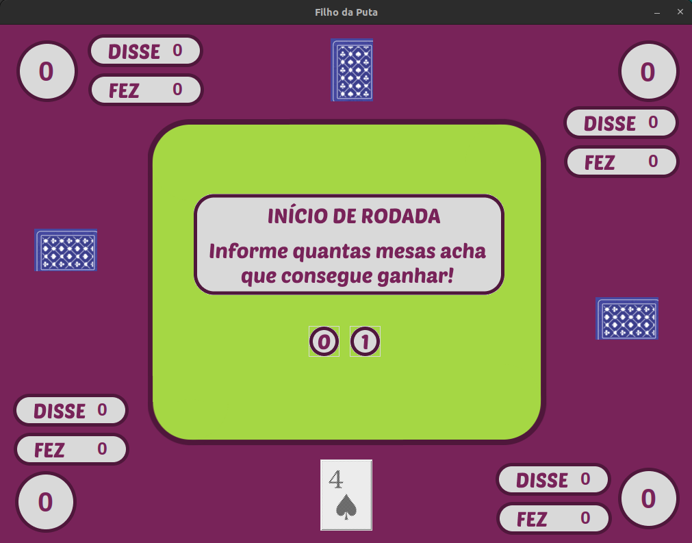

## Jogo FDP

## Exemplo de tela do jogo



## Como executar
1. Navegue até o diretório do projeto
   ``` bash
    cd .../FDP_04

2. Crie um ambiente virtual e ative-o
   ``` bash
    python -m venv nome_do_ambiente

3. Instale as dependências
    ``` bash
    pip install requirements.txt

4. Entre no diretório "src"
   ``` bash
    cd .../FDP_04/src

5. Execute o arquivo main
   ``` bash
    python main.py
